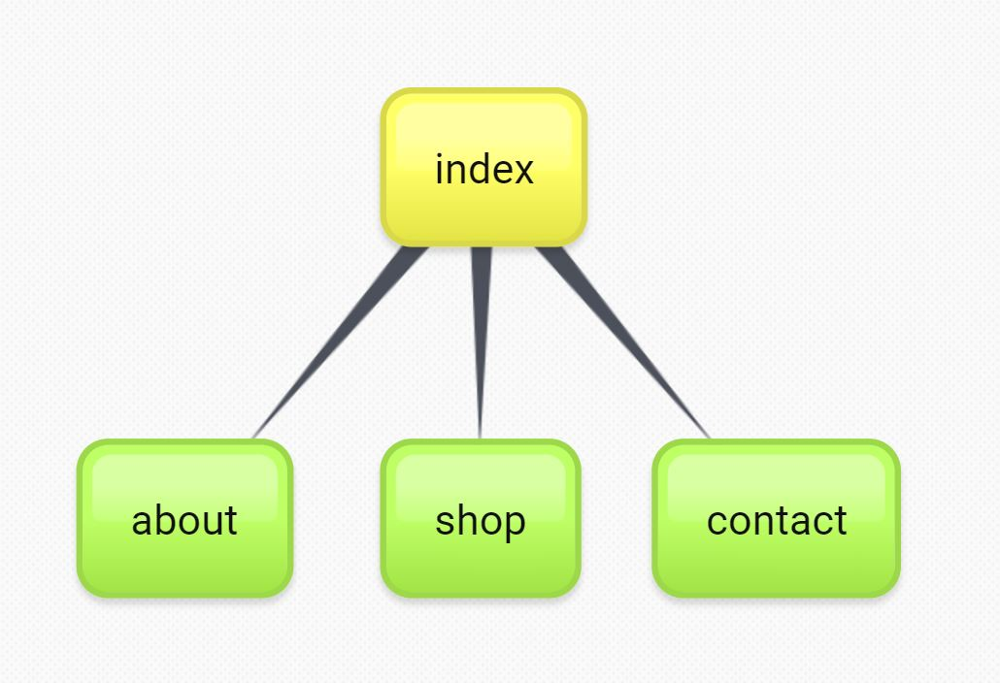
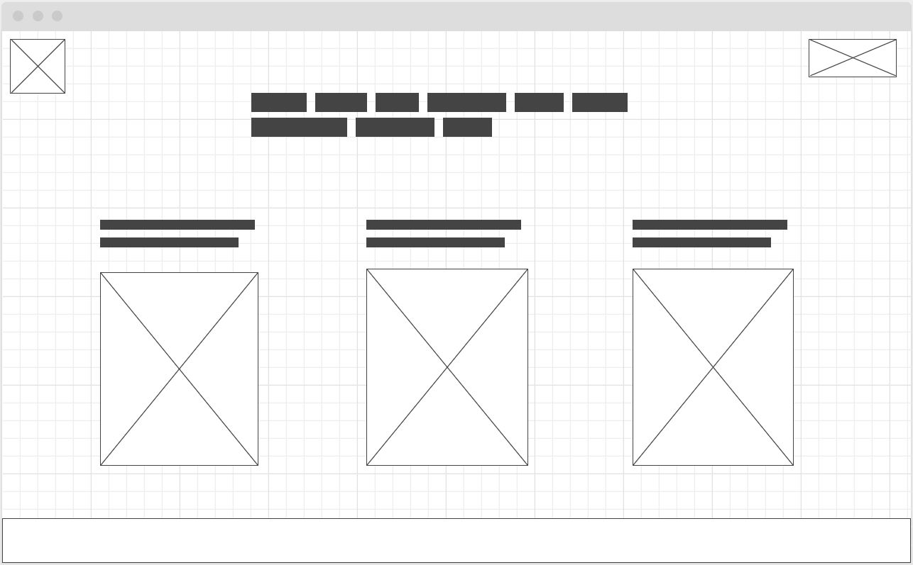

# Projektplan - Eget Projekt HT19

## Power Peak

- 2019/9/18
- Emanuel Carlhed
- Power Peak
- Adress
- Stad

### Mål / Syfte / Vision med webbplatsen

Träningströjor med gummitryck på ryggen för fäste vid liggande övningar, t.ex bänkpress.

### Målgrupp

Träningsinriktade människor som är intresserade av lite mer premium produkter och funktionella tröjor.

### Research och inhämtning av material

Jag har tagit inspiration till några av ikonerna som används på sidan ifrån Google Bilder.

[Pure CSS3 Smooth Scrolling To A DIV OnClick - No Javascript - Pure Html5 and CSS3 Tutorial](https://www.youtube.com/watch?v=KbMJPNXYYnw)

## Beskrivning av webbplatsen

Köp din träningströja ifrån oss med ett gummitryck på tröjans baksida för att få ett bra grepp på underlaget vid till exempel bänkpress.

### Innehåll på webbplatsen i stora drag -> känslan som den försöker förmedla.

Stilren design, enkel att använda, lätt direkt information

###Design/Form

######Sitemap

######Wireframe

#####Beskriv idén med kompositionen på de olika sidorna

#####Logotyper
De flesta logotyperna som kommer används är scaleable vector graphics. Uppe i det vänstra hörnet finns ett hus som ska fungera som en hemknapp till indexen. Uppe i det högra hörnet finns en slider för att ändra sidan till darkmode. Samt ikonerna till dessa ankare i mitten.

#####Färger
[Färgpalett](https://flatuicolors.com/palette/us)

###Text

Finns det text? Vilken font? Vad har texten för syfte? Vad har texten för färg och form? Är texten läsbar? Är texten informativ? Vad är karaktären på texten, tex skämtsam eller allvarlig

###Bild

Vad har bilderna för syfte? Karaktär på bilderna?

###Rörliga bilder

Finns det med rörliga bilder? Vad är det för sorts rörliga bilder (video, animeringar)? Vad har man för syfte med de rörliga bilderna? Är de rörliga bilderna stora eller små? Kan man styra de rörliga bilderna?

###Ljud

Finns det med ljud? Vad är det för slags ljud? Går ljudet att styra? Vad har man för syfte med ljudet?

###Interaktivitet

Finns det knappar, hotspots, menyval eller andra former av inmatningar från användaren? Kan man som användare vända och gå tillbaka? Kan man styra ljud och rörliga bilder? Går det att avbryta mitt i? Finns det formulär?

###Funktioner

Vad ska det finnas för funktioner? Viktiga? Mindre viktiga? Beskriv och förklara så utförligt du kan och skriv dem i en prioriteringslista: Viktigast först!
+++ <!-- Sätt igång och koda din webbplats stenhårt! --> +++

##Stilguide & Tester

###Stilguide

Beskriv sidans layout, mått, typografi och färg som en mall för andra designers, om de skulle ta över efter dig. Går bra att göra med skärmdumpar och kommentarer till.

###Testning

Beskriv hur du testat din design, med vilka verktyg och vad du kommit fram till. Även om du ändrat något i designen pga testresultaten.

##Slutsats och sammanfattning

➔	Berätta hur arbetet har gått: Vilka problem ni stött på och hur ni löst dem.

➔	Berätta vilka anpassningar ni gjort av er ursprungliga planering och design, påverkat av era tester eller annat som hänt under arbetets gång.

➔	Beskriv hur ni tycker att ni kan förbättra arbetet.
